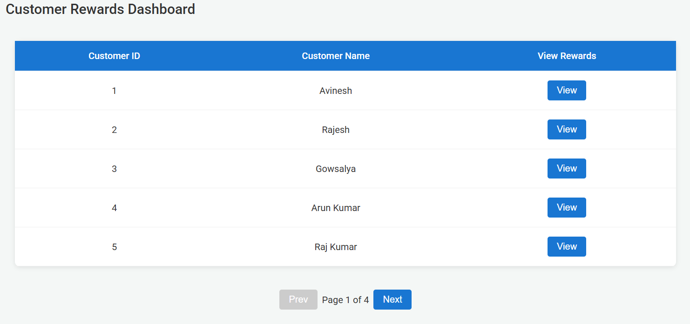
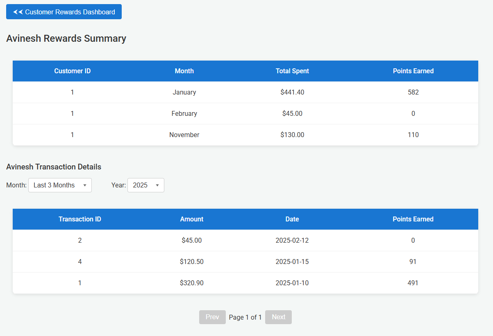

## Project Overview

A React.js application that calculates customer reward points based on their transactions. The reward points are calculated using the following criteria:

- **1 point** for every dollar spent between **$50 - $100**
- **2 points** for every dollar spent over **$100**

This application:

- Fetches transactions via a simulated API
- Displays customer reward points per month
- Allows filtering transactions by customer & month
- Implements pagination for better UX
- Uses styled-components for UI styling
- Includes unit tests for calculations, API, and UI components

---

## Features

- **Reward Points Calculation**
- **Monthly Filtering**
- **Pagination**
- **API Simulation**
- **Unit Testing**
- **Styled Components**

---

## Installation & Setup

### **1. Clone the Repository**

```sh
git clone https://github.com/Avineshrv/code-evaluation.git
cd code-evaluation
```

### **2. Install Dependencies**

```sh
npm install
```

### **3. Run the Application**

```sh
npm run dev
```

---

## Usage

1. Open the application in your browser.
2. View the list of customers.
3. Click on "View" to see a customer's rewards per month.
4. Filter transactions by selecting a specific month.
5. Use pagination to navigate large datasets.

---

## API Details

The application simulates fetching transactions using an asynchronous API.

### **Sample API Response (`api.js`)**

```json
[
  {
    "customerId": 1,
    "transactionId": "T1",
    "amount": 120,
    "date": "2025-01-15"
  },
  {
    "customerId": 1,
    "transactionId": "T2",
    "amount": 75,
    "date": "2025-02-10"
  },
  {
    "customerId": 2,
    "transactionId": "T3",
    "amount": 200,
    "date": "2025-01-20"
  },
  ...
]
```

---

## Screenshots



